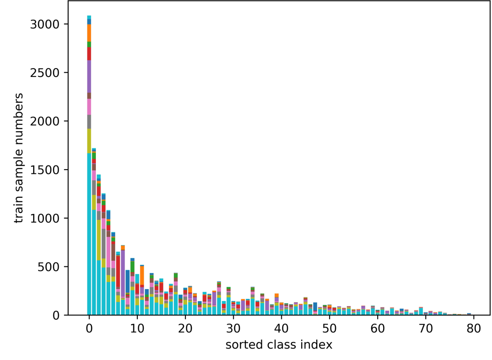

## Requirements 
* [Pytorch](https://pytorch.org/)
* [Sklearn](https://scikit-learn.org/stable/)

## Quick start

### Training

#### COCO-MLT
```
python tools/train.py configs/coco/LT_resnet50_pfc_DB.py 
```

#### VOC-MLT
```
python tools/train.py configs/voc/LT_resnet50_pfc_DB.py 
```

### Testing

#### COCO-MLT
```
bash tools/dist_test.sh configs/coco/LT_resnet50_pfc_DB.py work_dirs/LT_coco_resnet50_pfc_DB/epoch_8.pth 1
```

#### VOC-MLT
```
bash tools/dist_test.sh configs/voc/LT_resnet50_pfc_DB.py work_dirs/LT_voc_resnet50_pfc_DB/epoch_8.pth 1
```

## Pre-trained models

#### COCO-MLT

|   Backbone  |    Total   |    Head   |  Medium  |   Tail  |      Download      |
| :---------: | :------------: | :-----------: | :---------: | :---------: | :----------------: |
|  ResNet-50  |      53.55      |      51.13     |    57.05     |     51.06    |     [model](https://drive.google.com/file/d/1HPQMmPVfqiDUTmzrTxNv3clhYa662QKb/view?usp=sharing)      |

####  VOC-MLT

|   Backbone  |    Total   |    Head   |  Medium  |   Tail  |      Download      |
| :---------: | :------------: | :-----------: | :---------: | :---------: | :----------------: |
|  ResNet-50  |      78.94      |      73.22     |    84.18     |     79.30    |     [model](https://drive.google.com/file/d/1jGHiCfQKDNjdYxjKXfp8ifFadW2BuGWm/view?usp=sharing)      |

## Datasets



### Use our dataset
The long-tail multi-label datasets we use in the paper are created from [MS COCO](https://cocodataset.org/) 2017 and [Pascal VOC](http://host.robots.ox.ac.uk/pascal/VOC/) 2012. Annotations and statistics data resuired when training are saved under `./appendix` in this repo.
```
appendix
  |--coco
    |--longtail2017
      |--class_freq.pkl
      |--class_split.pkl
      |--img_id.pkl
  |--VOCdevkit
    |--longtail2012
      |--class_freq.pkl
      |--class_split.pkl
      |--img_id.pkl
```

### Try your own
You can also create a new long-tailed dataset by downloading the annotations, `terse_gt_2017.pkl` for COCO and `terse_gt_2012.pkl` for VOC, from [here](https://drive.google.com/drive/folders/1B7-GODp-HDH24OzEafCIV4IfAJ_R7NuE?usp=sharing) and move them into the right folders as below.
```
appendix
  |--coco
    |--longtail2017
      |--terse_gt_2017.pkl
  |--VOCdevkit
    |--longtail2012
      |--terse_gt_2012.pkl
```
Then run the following command, adjust the parameters as you like to control the distribution.
```
python tools/create_longtail_dataset.py
```
To update the corresponding `class_freq.pkl` files, please refer to `def _save_info` in `.\mllt\datasets\custom.py`.


## TODO
- [ ] Distributed training is not supported currently
- [ ] Evaluation with single GPU is not supported currently
- [ ] test pytorch 0.4.0


